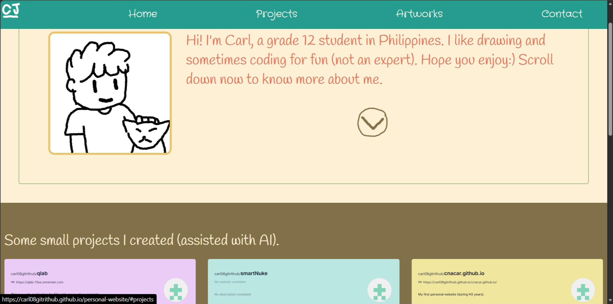

# CJNACAR: Personal Website

This is my personal website, which is pretty a long time to get myself back on creating CS projects. This website was also refreshing, because I actually forgot most of the basics of CSS and JS. But overall, this website is about myself, my hobbies, and... of course, a sort of ---trademark--- a CUTE-ty illustration of me and my cat (Upin).

## Preview

A preview of my personal website:


You can also view the live website here:

🔗[Visit the Live Website](https://carl08gitrithub.github.io/personal-website/)

## Features
1. Navigation Bar
2. Github Deck-like cards
2. Art Gallery


## If you want to run the website ⬇️
This is just a simple static website, so no need to worry about complicated stuffs. :) [I also hate complicated things.. heheehe]

### 1. Clone the repository (make sure you installed git)
```bash
git clone https://github.com/carl08gitrithub/personal-website.git
```

### 2. Navigate to the project folder
```bash
cd personal-website
```

### 3. Open the website
Open `index.html` in your preferred web browser.Done!


## TECH
I used pure HTML, CSS, and JS. [cause i don't know any frameworks... too busy with my life]

## Credits
First in foremost, I want to thank my friend for sharing the stardance hackclub program (funny thing that I'm the one who shared hackclub first). Thanks Josh! And of course the two websites who made my life easier, GithubCards and W3Schools (helped me since junior high).
